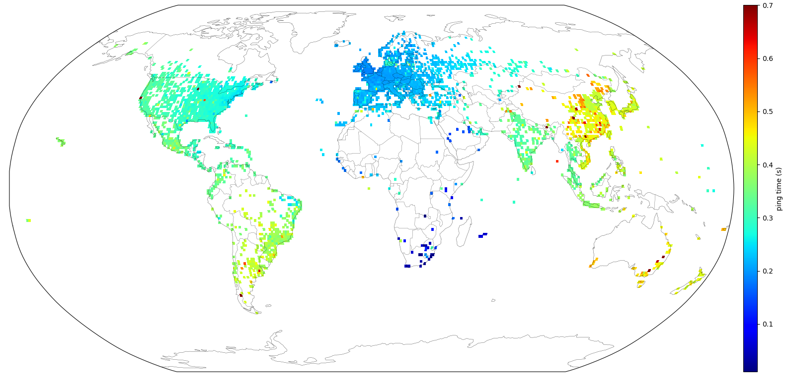
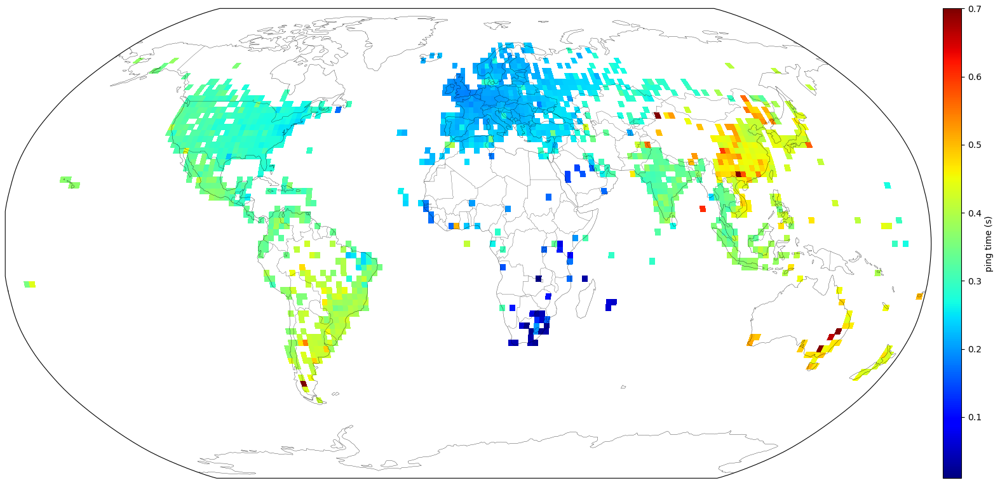

# Ping Maps

Ping the world and make a map of round trip times.
Inspired by Erik Bernhardsson's [Ping the World](https://erikbern.com/2015/04/26/ping-the-world.html).

Results from Johannesburg for 60,000 pings, averaged per 1&deg;&#215;1&deg;:

<figure>

</figure>

Averaged per 2&deg;&#215;2&deg;:

<figure>

</figure>

Geolocation is sourced using [MaxMind's Geolite2](https://dev.maxmind.com/geoip/geolite2-free-geolocation-data) database. Default locations for countries are excluded.